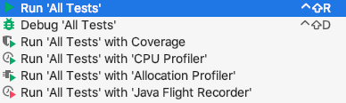

# CS4218 Software Testing Project - The SHELL
*Group Project for CS4218, 19/20 Sem2*

## How to run tests

- Right click on test folder, choose `Run 'All Tests'`



- Or run with maven command

  ```bash
  mvn test
  ```

If you want to run this app in the terminal
execute this command in the root directory:

>  mvn compile -Pcode-mainclass

